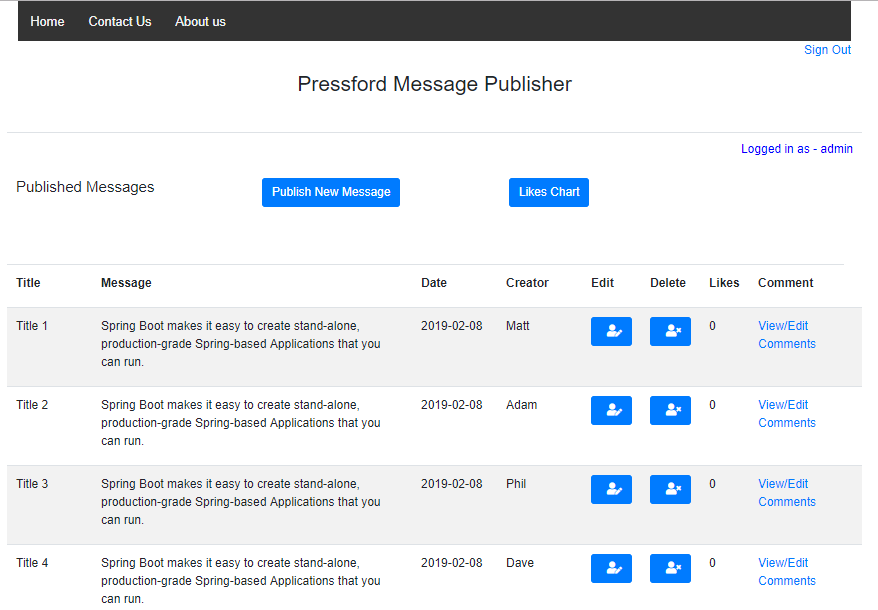
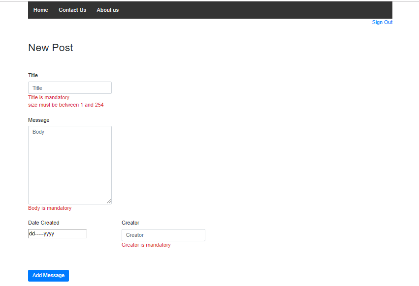
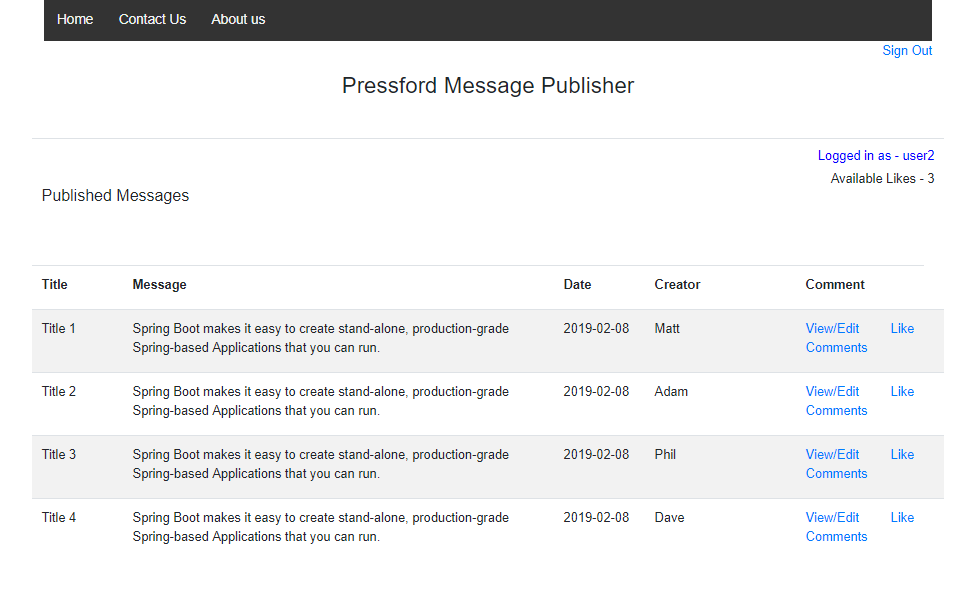
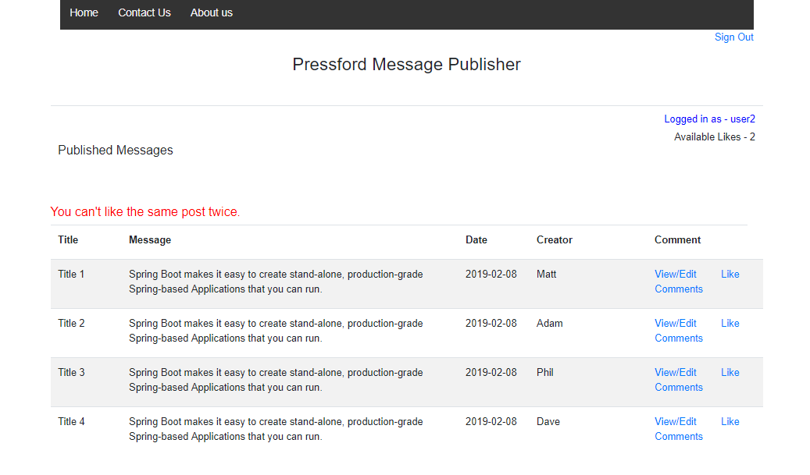
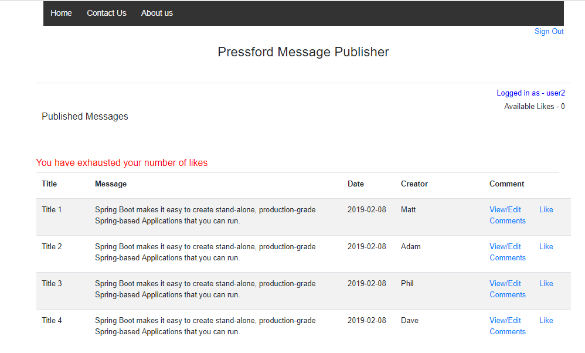
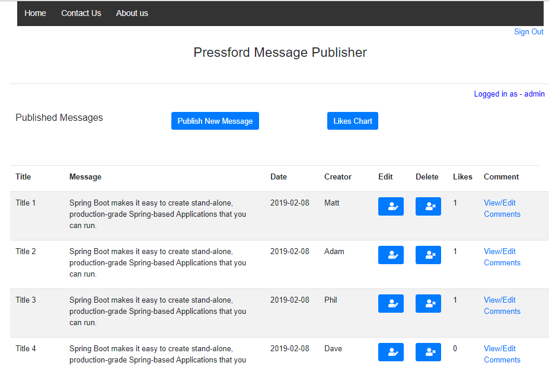
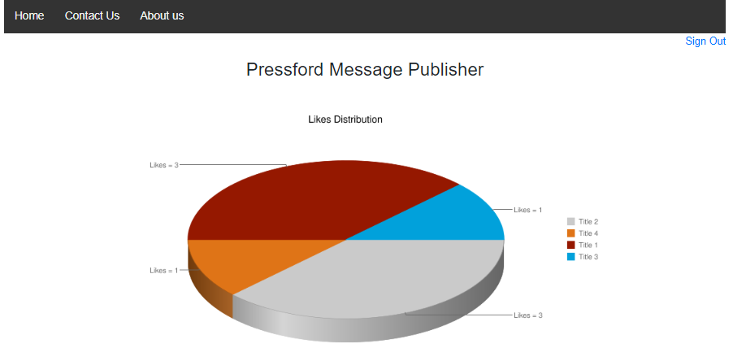
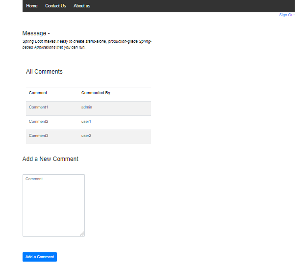
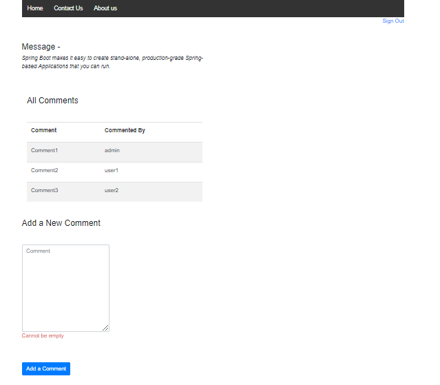

# Pressford Message Publisher

A simple Java based message(news articles) publishing system. A publisher can add/edit/delete the messages and can comment on them as well.A publisher can also see the number of likes on each message. Employees can view/like the messages and comment on them. Employees have limited number of likes, once exhausted they can't like any message further. Employees can't like the same message twice. Publisher also can see a pie chart to check the distribution of likes against the messages. 

## About

Technologies used : Java, Spring Boot, Spring Security, Thymeleaf, Spring Data JPA.
Database : In memory H2 database

There are pre-defined roles - Publisher and Employee. 

1 admin and 3 users are pre-configured in the application and many can be configured in application.properties by passing the values as a Map:

```
# Map to create new users/admin
# Pass comma seperated values in the Map.
# Values should be in format - 'username,password,role'
# Roles can be EMPLOYEE or PUBLISHER only
pressford.user.map={user1: 'admin,admin,PUBLISHER', user2: 'user1,user,EMPLOYEE', user3: 'user2,user,EMPLOYEE', user4: 'user3,user,EMPLOYEE'}

```
You can also set the number of likes, used number of likes and remaining likes in application.properties for each created user.
Value should be in format - 'username, TotalNumberOfLikes, LikeUsed, RemainingLikes':

```
# Map to create users having EMPLOYEE roles with likes counts
# Pass comma seperated values in the Map.
# Values should be in format - 'username, TotalNumberOfLikes, LikeUsed, RemainingLikes'
pressford.user.likes.map={user1: 'user1,2,0,2', user2: 'user2,3,0,3', user3: 'user3,4,0,4'}

```

Whitelisting of permissions can be configured for any future pages additions - 

```
# Whitelisted list of the pages allowed to all to access
pages.permil.all=/home,/js/**,/css/**,/img/**,/webjars/**

# Whitelisted list of the pages allowed to PUBLISHER to access
pages.permit.publisher=/signup,/edit/*,/update/*,/delete/*

```

Server port can also be configured in the application.properties file.

### Messages

Only Publishers can add or update or delete a message. Icons are present on the screen for edit and delete:





Validations are in place at the time of message publishing:





Employees can like the messages:





Employees only have a limited number of likes available with them (set at the application run time and customizable in properties file).
If employees like the same post twice, they would get an error message on the screen:





If the number of likes have been exhausted by the employees and they try to like any other message, they would get an error:





Publishers can see the number of likes on each message:





At this point of time, the only way to increase/decrease the number of likes is to reset the number at the application start time.


### Likes-Messages Pie Chart

Publishers can view the likes on each comment in the form of pie chart:





### Comments on Messages

Publisher and Employees both can comment on the messages at any point of time and see each other's comments:





Validations are in place at the time of adding a comment.





## Running the application

There are several ways to run the application. You can run it from the command line with included Maven Wrapper or Maven.

Once the app starts, go to the web browser and visit `http://localhost:8080`

Admin username: **admin**

Admin password: **admin**

User1 username: **user1**

User1 password: **user**

User2 username: **user2**

User2 password: **user**

User3 username: **user3**

User3 password: **user**

User4 username: **user4**

User4 password: **user**

### Maven

Open a terminal and run the following commands to ensure that you have valid versions of Java and Maven installed:

```bash
$ java -version
java version "1.8.0_152"
Java(TM) SE Runtime Environment (build 1.8.0_152-b16)
Java HotSpot(TM) 64-Bit Server VM (build 25.152-b16, mixed mode)
```

```bash
$mvn -v
Apache Maven 3.5.2 (138edd61fd100ec658bfa2d307c43b76940a5d7d; 2017-10-18T13:28:13+05:30)
Maven home: D:\softwares\apache-maven-3.5.2\bin\..
Java version: 1.8.0_152, vendor: Oracle Corporation
Java home: C:\Program Files\Java\jdk1.8.0_152\jre
```

#### Using the Maven Plugin

The Spring Boot Maven plugin includes a run goal that can be used to quickly compile and run your application. 
Applications run in an exploded form, as they do in your IDE. 
The following example shows a typical Maven command to run a Spring Boot application:
 
```bash
$ mvn spring-boot:run
``` 

#### Using Executable Jar

To create an executable jar run:

```bash
$ mvn clean package
``` 

To run that application, use the java -jar command, as follows:

```bash
$ java -jar target/pressford-publisher.jar
```

To exit the application, press **ctrl-c**.